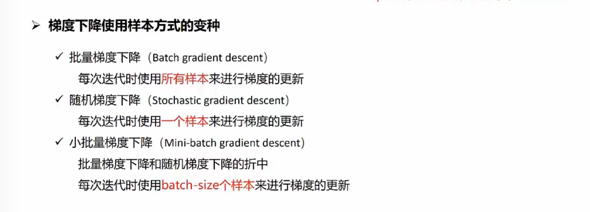

##### 卷积神经网络学习
###### CNN 基本结构
* 卷积神经网络概述
* 输入层与卷积层
* 卷积、stride、padding
* 激活、池化、全连接

###### CNN 网络训练：损失与误差的反向传播，模型评估与正则化
* 损失与梯度下降
* 反向传播、泛化、正则化
* 网络搭建
* AlexNet、VGG
* GoogLeNet、Resnet

###### CNN实战
* 实践：猫狗分类

##### 一、卷积神经网络概述
###### （一）目的
* 用于解决全连接神经网络处理时（图像问题）的参数数量问题
* 为了提取图像特征，用于处理图像中相似特征出现在不同位置的情况
* 为了用于处理不同图像大小时还能正确识别的情况

###### （二）结构组成
* 输入层
* 卷积层
* 激活层
* 池化层
* 全连接层
* 具体网络结构详见：

##### 二、输入层与卷积层
###### （一）输入层与卷积层的联系
* 特征提取器（flter）的通道数要和输入层的通道数保持一致

##### 三、卷积、stride、padding
###### （一）卷积处理过程
* 卷积运算的时候，Input和卷积核的通道（channel）数要求相同

* 使用单个卷积核提取单个特征的时候，如Input（6*6*3） + 1个卷积核（3*3*3） = 1个特征提取结果（4*4*1），如下图所示：
  

* 使用2个卷积核提取多个特征的时候，如Input（6*6*3） + 2个卷积核（3*3*3） = 2个特征提取结果（4*4*2），如下图所示：
  

* 使用多个卷积核提取多个特征的时候，如Input（32*32*3） + 6个卷积核（5*5*3） -> 特征提取结果（28*28*6）+ 10个卷积核（5*5*6）-> 10个特征提取结果（24*24*10），如下图所示：
  

* 单层卷积得到局部特征，多层卷积得到特征全局化（感受野层层映射）

###### （二）stride
* stride 为在进行卷积运算的时候，卷积核在输入上的滑动步长
* stride设置后，卷积核在Input的不同的维度上将以相同的步长滑动，增加stride能够减少计算量
  
* stride的设置将会影响输出（特征提取结果的大小）

###### （三）padding
* 使用padding的目的是为了在卷积操作后控制输出和输入的大小维度保持相同
* 常见padding操作可以在输入的周边补0，如下图所示
  

###### （四）总结
* 输入、卷积核、stride、padding的不同设置，会导致卷积计算生成不同的结果，详见下图：  
  

##### 四、激活、池化、全连接
###### （一）激活
* 激活函数的作用是：往模型中加入非线性元素，能表示更大范围的函数，一般不在同一个网络中使用多个激活函数，如下图所示：
  

* 激活函数得到的值（0-1 或 -1~1）会随着网络层数的加深，会导致值越来越小，则会使得参数的改变使得输出值的变化越来越小，即梯度消失想象

###### （二）池化  
* 池化就是下采样，包括：平均池化、最大池化，其目的在于压缩图像，减少参数数量
* 平均池化：取平均值；最大池化：取最大值
* 吃画的具体描述，详见下图：  
  
* 池化层计算方式，详见下图：
  

###### （三）全连接
* 全连接层会将多维输入拉伸为一维输入，详情如下：  
  
* 能够打破卷积特征的空间限制
* 最终得到一个可以对不同类别进行区分的得分

###### （四）卷积神经网络的总结
* 卷积神经网络的示意图如下所示：  
  

* 卷积层+池化层+relu激活函数的目的：提取特征
* 全连接层等输出层的目的：作分类器/检测器/分割器 

##### 五、损失和梯度下降  
###### （一）损失
* 深度学习的过程，实际上包括：
	1. 对权重和偏置随机赋值
	2. 经过一系列调整，不断修改权重和偏置，使得输出结果符合要求
* 由上可知，如何调整是重点，其包括：
	1. 如何计算网络得分和标签的不同
	2. 如何根据上述差异对网路的权重参数W进行更新
详情见下图：  

* 解决办法：解决“如何计算网络得分和标签的不同”
	1. 将输出值转换为正值（指数运算）
	2. 将得到的正值通过softmax函数正则化（概率归一化），就将输出值转换为了概率分布
  
	3. 但是为了更好地度量网络训练程度，选择使用损失函数：将得到的不同概率值和标签值（0或1）通过损失函数计算，得到损失值
  

###### （二）梯度下降  
* 解决办法：解决“如何调整更新权重参数”->调整梯度进行更新：梯度下降法
	1. 使用梯度下降法进行参数的更新，如下图所示：

* 梯度下降的样本的不同选择：
	1. 批量梯度下降：每次迭代使用所有样本进行梯度的更新，最为准确，计算量最大
	2. 随机梯度下降：每次迭代使用一个样本来进行梯度的更新，最快，计算量最小
	3. 小批量梯度下降：每次迭代使用batch-size个样本进行更新，是折中的方式

* 梯度下降方式的优化：
	1. adam
	2.......

##### 六、反向传播、泛化、正则化
###### （一）反向传播
* 求解损失对所有参数的梯度
* 求解过程：
	1. forward pass：逐层计算，保存每一层的参数，方便反向传播计算梯度时使用
	2. Backward pass：根据最后的损失倒叙逐层计算每一参数的梯度，为参数的更新提供依据
* 以计算sigmoid函数为例，具体过程如下图：

###### （二）泛化
* 泛化能力是指机器学习算法对位置样本的适应能力，具体包括：
	1. 学到隐含在数据集背后的规律
	2. 针对具有统一规律的训练集以外的数据
	3. 经过训练的网络也能给出合适的输出
* 泛化主要解决的问题：过拟合和欠拟合问题
	1. 解决欠拟合问题：降低训练误差
	2. 解决过拟合问题：缩小训练误差和测试误差的差距
* 欠拟合问题：训练误差高
	1. 表现: 训练集和测试集上精确度都低
	2. 实质：模型的表示能力不够

* 过拟合问题：训练误差和测试误差间差距大
	1. 表现：训练集上精确度高，测试集上精确度低
	2. 实质：模型模拟了训练数据独有的噪声（噪声数据是指训练集中不正确的数据）

###### （三）正则化
* 深度学习模型具有的特点如下，包括：
	1. 高模型容量：高拟合各种函数的能力，模型偏向于过拟合
	2. 因此选择提高泛化能力的策略是：正则化——包括对学习算法的修改，减少测试误差而不是训练误差
	3. 具体策略为：早停法、权重正则化、数据增强

##### 七、网络搭建
###### （一）、使用到的数据集
* Mnist 数据集
* Cifar数据集
* ImageNet数据集

###### （二）、搭建CNN的过程
* 定义模型的整体框架
	1. 定义网络结构-定义神经网络的传播过程
	2. 定义优化算法-定义优化算法、参数更新方式、步长设置
	3. 定义输出日志-0打印训练过程中得到的模型在验证集上的精确度和在训练集上的精确度，获知模型是否（欠）拟合
	4. 定义最终获得的模型参数的保存路径-保存训练结果/模型

* 导入数据和预处理
	1. 处理数据集的数据，使之适合模型使用
* 训练模型
	1. 把所有的代码交给平台运行
* 测试模型 
	2. 使用新数据看看模型是否好用

###### （三）、搭建CNN的例子
* 使用简化的LeNet-5建立模型，具体如下：  

##### 八、经典的CNN网络结构
* 经典CNN网络结构说明：

###### （一）、AlexNet
* AlexNet网络结构说明
###### （二）、VGG
###### （三）、GoogleNet
###### （四）、ResNet
