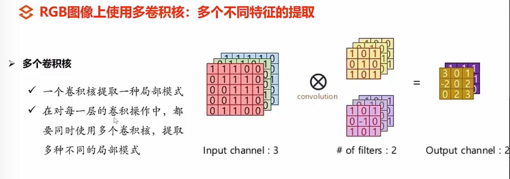

##### 卷积神经网络学习
###### CNN 基本结构
* 卷积神经网络概述
* 输入层与卷积层
* 卷积、stride、padding
* 激活、池化、全连接

###### CNN 网络训练：损失与误差的反向传播，模型评估与正则化
* 损失与梯度下降
* 反向传播、泛化、正则化
* 网络搭建
* AlexNet、VGG
* GoogLeNet、Resnet

###### CNN实战
* 实践：猫狗分类

##### 一、卷积神经网络概述
###### （一）目的
* 用于解决全连接神经网络处理时（图像问题）的参数数量问题
* 为了提取图像特征，用于处理图像中相似特征出现在不同位置的情况
* 为了用于处理不同图像大小时还能正确识别的情况

###### （二）结构组成
* 输入层
* 卷积层
* 激活层
* 池化层
* 全连接层
* 具体网络结构详见：

##### 二、输入层与卷积层
###### （一）输入层与卷积层的联系
* 特征提取器（flter）的通道数要和输入层的通道数保持一致

##### 三、卷积、stride、padding
###### （一）卷积处理过程
* 卷积运算的时候，Input和卷积核的通道（channel）数要求相同

* 使用单个卷积核提取单个特征的时候，如Input（6*6*3） + 1个卷积核（3*3*3） = 1个特征提取结果（4*4*1），如下图所示：
  

* 使用2个卷积核提取多个特征的时候，如Input（6*6*3） + 2个卷积核（3*3*3） = 2个特征提取结果（4*4*2），如下图所示：
  

* 使用多个卷积核提取多个特征的时候，如Input（32*32*3） + 6个卷积核（5*5*3） -> 特征提取结果（28*28*6）+ 10个卷积核（5*5*6）-> 10个特征提取结果（24*24*10），如下图所示：
  

* 单层卷积得到局部特征，多层卷积得到特征全局化（感受野层层映射）

###### （二）stride
* stride 为在进行卷积运算的时候，卷积核在输入上的滑动步长
* stride设置后，卷积核在Input的不同的维度上将以相同的步长滑动，增加stride能够减少计算量
  
* stride的设置将会影响输出（特征提取结果的大小）

###### （三）padding
* 使用padding的目的是为了在卷积操作后控制输出和输入的大小维度保持相同
* 常见padding操作可以在输入的周边补0，如下图所示
  

###### （四）总结
* 输入、卷积核、stride、padding的不同设置，会导致卷积计算生成不同的结果，详见下图：  
  

##### 四、激活、池化、全连接
###### （一）激活
* 激活函数的作用是：往模型中加入非线性元素，能表示更大范围的函数，一般不在同一个网络中使用多个激活函数，如下图所示：
  

* 激活函数得到的值（0-1 或 -1~1）会随着网络层数的加深，会导致值越来越小，则会使得参数的改变使得输出值的变化越来越小，即梯度消失想象

###### （二）池化  
* 池化就是下采样，包括：平均池化、最大池化，其目的在于压缩图像，减少参数数量
* 平均池化：取平均值；最大池化：取最大值
* 吃画的具体描述，详见下图：  
  
* 池化层计算方式，详见下图：
  

###### （三）全连接
* 全连接层会将多维输入拉伸为一维输入，详情如下：  
  
* 能够打破卷积特征的空间限制
* 最终得到一个可以对不同类别进行区分的得分

###### （四）卷积神经网络的总结
* 卷积神经网络的示意图如下所示：  
  

* 卷积层+池化层+relu激活函数的目的：提取特征
* 全连接层等输出层的目的：作分类器/检测器/分割器 

##### 五、损失和梯度下降  
###### （一）损失
* 深度学习的过程，实际上包括：
	1. 对权重和偏置随机赋值
	2. 经过一系列调整，不断修改权重和偏置，使得输出结果符合要求
* 由上可知，如何调整是重点，其包括：
	1. 如何计算网络得分和标签的不同
	2. 如何根据上述差异对网路的权重参数W进行更新
详情见下图：  

* 解决办法：解决“如何计算网络得分和标签的不同”
	1. 将输出值转换为正值（指数运算）
	2. 将得到的正值通过softmax函数正则化（概率归一化），就将输出值转换为了概率分布
  
	3. 但是为了更好地度量网络训练程度，选择使用损失函数：将得到的不同概率值和标签值（0或1）通过损失函数计算，得到损失值
  

###### （二）梯度下降  
* 解决办法：解决“如何调整更新权重参数”->调整梯度进行更新：梯度下降法
	1. 使用梯度下降法进行参数的更新，如下图所示：

* 梯度下降的样本的不同选择：
	1. 批量梯度下降：每次迭代使用所有样本进行梯度的更新，最为准确，计算量最大
	2. 随机梯度下降：每次迭代使用一个样本来进行梯度的更新，最快，计算量最小
	3. 小批量梯度下降：每次迭代使用batch-size个样本进行更新，是折中的方式

* 梯度下降方式的优化：
	1. adam
	2.......

##### 六、反向传播、泛化、正则化
###### （一）反向传播
	
###### （二）泛化
###### （三）正则化
